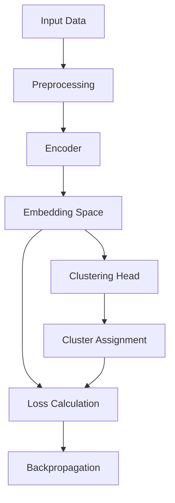

# 📚 Student Clustering Project

## 🚀 Giới thiệu

Dự án này thực hiện **clustering học sinh** dựa trên điểm số, hạnh kiểm, danh hiệu, giáo viên chủ nhiệm và một số chỉ số khác.  
Mục tiêu là **tự động nhóm học sinh** thành các cụm có ý nghĩa mà không cần nhãn, sử dụng kỹ thuật **representation learning** kết hợp **self-supervised learning** và **unsupervised clustering**.

---

## 🛠️ Pipeline Tiền Xử Lý Dữ Liệu

**File:** [`dataset.py`](./dataset.py)

- Đọc dữ liệu từ file `.xlsx`.
- Các loại cột:
  - **Numerical**: điểm số các môn học, xếp hạng, tổng kết,...
  - **Ordinal**: học lực, hạnh kiểm, danh hiệu (có thứ tự).
  - **Nominal**: giáo viên chủ nhiệm (không thứ tự).
- **Tiền xử lý:**
  - Numerical: Impute bằng **median**, chuẩn hóa **StandardScaler**.
  - Ordinal: Impute bằng **most frequent**, encode bằng **OrdinalEncoder** theo mapping.
  - Nominal: Impute bằng **most frequent**, encode bằng **OrdinalEncoder**.

- Dữ liệu sau xử lý được chuyển thành **TensorDataset**.

---

## 🏗️ Cấu Trúc Mô Hình

**File:** [`model.py`](./model.py)

### 1. Encoder
- Ánh xạ đầu vào thành vector nhúng (`embedding`).
- Cấu trúc: 3 tầng Linear + BatchNorm + ReLU + Dropout.

### 2. Clustering Head
- Dự đoán phân cụm từ embedding.
- Cấu trúc: Linear -> ReLU -> Dropout -> Linear (ra logits cụm).

---

## 🧠 Phân Tích Các Hàm Loss

**File:** [`train.py`](./train.py)

Hàm `total_loss_fn` = tổ hợp nhiều thành phần:

| Thành phần | Công thức | Giải thích |
| :--- | :--- | :--- |
| **Contrastive Loss** | $$ \mathcal{L}_{\text{contrastive}} = \text{CrossEntropy}(\text{sim}(z_1, z_2)/T) $$ | Thúc đẩy augmentations của cùng mẫu gần nhau. |
| **Clustering Loss** | $$ \mathcal{L}_{\text{cluster}} = \text{KL}(p \parallel q) $$ | Làm phân phối dự đoán sắc nét và cân bằng. |
| **Compactness Loss** | $$ \mathcal{L}_{\text{compact}} = \frac{1}{N} \sum_{k=1}^{K} \sum_{i \in C_k} \| z_i - \mu_k \|^2 $$ | Các điểm trong cụm gần tâm cụm. |
| **Separation Loss** | $$ \mathcal{L}_{\text{separation}} = \sum_{i \neq j} \frac{1}{\| \mu_i - \mu_j \|^2 + \epsilon} $$ | Tâm các cụm càng xa nhau càng tốt. |

Trong đó:
- \( z_1, z_2 \) là các embedding sau augmentation.
- \( T \) là temperature.
- \( p \) là phân phối softmax output.
- \( q \) là phân phối sharpened.
- \( \mu_k \) là tâm cụm thứ \(k\).
- \( C_k \) là tập điểm thuộc cụm \(k\).

### Tổng Loss:

$$
\mathcal{L}_{\text{total}} = \alpha \mathcal{L}_{\text{contrastive}} + \beta \mathcal{L}_{\text{cluster}} + \gamma \mathcal{L}_{\text{compact}} + \delta \mathcal{L}_{\text{separation}}
$$


---

## 🔥 Quá Trình Huấn Luyện

- Augmentation đầu vào: noise, dropout, scale jitter.
- Huấn luyện encoder + clustering head cùng lúc.
- Early stopping dựa trên Silhouette Score.
- Lưu checkpoint tốt nhất.
- TensorBoard để theo dõi loss và metrics.
- Visualization cụm học sinh theo từng epoch.

### Flowchart tổng quan:



---

## 📊 Phương Pháp Đánh Giá Clustering

Khi thực hiện phân cụm (clustering), ta cần các chỉ số để **đánh giá chất lượng** của kết quả. Ba phương pháp phổ biến nhất gồm:

---

### 1. **Silhouette Score**

- **Giới thiệu:**  
Silhouette Score đo lường **mức độ gắn kết** (cohesion) của các điểm trong cùng cụm và **mức độ phân tách** (separation) giữa các cụm khác nhau.

- **Công thức:**  
Đối với mỗi điểm \( i \):
$$
s(i) = \frac{b(i) - a(i)}{\max(a(i), b(i))}
$$

Trong đó:
- \( a(i) \) = khoảng cách trung bình từ điểm \( i \) đến tất cả các điểm khác trong cùng cụm.
- \( b(i) \) = khoảng cách trung bình từ điểm \( i \) đến tất cả các điểm ở cụm gần nhất khác cụm \(i\).

Giá trị tổng thể là trung bình \( s(i) \) trên tất cả các điểm.

- **Ý nghĩa:**  
  - \( s(i) \) gần **1** → điểm nằm **gọn** trong cụm của nó.
  - \( s(i) \) gần **0** → điểm nằm **giữa** hai cụm.
  - \( s(i) \) gần **-1** → điểm có thể bị **gán nhầm cụm**.

- **Mục tiêu:** Càng cao càng tốt.

---

### 2. **Calinski-Harabasz Score** (CH Score)

- **Giới thiệu:**  
CH Score (còn gọi là **Variance Ratio Criterion**) đo tỷ lệ giữa **phân tán giữa các cụm** và **phân tán bên trong cụm**.

- **Công thức:**  
Giả sử có \( k \) cụm và tổng \( N \) điểm:
$$
\text{CH} = \frac{\text{tr}(B_k)}{\text{tr}(W_k)} \times \frac{N - k}{k - 1}
$$

Trong đó:
- \( \text{tr}(B_k) \) = trace (tổng đường chéo) của ma trận phân tán **giữa các cụm**.
- \( \text{tr}(W_k) \) = trace của ma trận phân tán **trong cụm**.

- **Ý nghĩa:**  
  - CH Score càng lớn → các cụm càng tách biệt rõ và càng chặt chẽ bên trong.
  - Phù hợp cho các tập dữ liệu có hình dạng cụm đơn giản (convex).

- **Mục tiêu:** Càng cao càng tốt.

---

### 3. **Davies-Bouldin Score** (DB Score)

- **Giới thiệu:**  
DB Score đo lường **mức độ tương đồng** giữa các cụm — cụm càng tương tự nhau càng **tệ**.

- **Công thức:**  
$$
\text{DB} = \frac{1}{k} \sum_{i=1}^{k} \max_{j \neq i} \left( \frac{S_i + S_j}{M_{ij}} \right)
$$

Trong đó:
- \( S_i \) = độ rộng (dispersion) trung bình của cụm \( i \).
- \( M_{ij} \) = khoảng cách giữa tâm cụm \( i \) và \( j \).

- **Ý nghĩa:**  
  - Chỉ số thấp → các cụm nhỏ gọn và xa nhau → clustering tốt.
  - Chỉ số cao → các cụm lớn, chồng lấn → clustering tệ.

- **Mục tiêu:** Càng thấp càng tốt.

---

## ✨ Tóm tắt nhanh

| Chỉ số | Công thức tổng quan                                                | Mục tiêu |  
| :--- |:-------------------------------------------------------------------| :--- |
| **Silhouette Score** | $$ \frac{b(i) - a(i)}{\max(a(i), b(i)} $$                          | Càng cao càng tốt |
| **Calinski-Harabasz Score** | $$ \frac{\text{tr}(B_k)}{\text{tr}(W_k)} \times \frac{N-k}{k-1} $$ | Càng cao càng tốt |
| **Davies-Bouldin Score** | $$Trung bình max ( \frac{S_i + S_j}{M_{ij}} )$$                    | Càng thấp càng tốt |


---

## ⚙️ Hướng Dẫn Chạy

```bash
# Cài thư viện cần thiết
pip install -r requirements.txt

# Huấn luyện mô hình
python train.py
```

Outputs:
- Logs: `out/logs/`
- Mô hình: `out/best_model.pt`
- Biểu đồ cụm: `out/clustering_epoch_X.png`

---

## 📊 Kết Quả So Sánh
### Đánh giá trên tập median_imputed.xlsx
| Mô hình                      | Silhouette ↑ | Calinski-Harabasz ↑ | Davies-Bouldin ↓ |
|------------------------------| ------------ | ------------------- | ---------------- |
| **Alo**                      | 0.8671       | 121540.13           | 0.1604           |
| **KMeans**                   | 0.5790       | 88582.15            | 0.5760           |
| **Expectation-Maximization** | 0.5772       | 88175.58            | 0.5760           |
| **Birch**                    | 0.5355       | 56833.10            | 0.5036           |
| **DBSCAN**                   | -0.2036      | 13719.50            | 2.9958           |

### Đánh giá trên tập group_imputed.xlsx
| Mô hình                      | Silhouette ↑ | Calinski-Harabasz ↑ | Davies-Bouldin ↓ |
|------------------------------| ------------ |---------------------|------------------|
| **Alo**                      | 0.8567       | 110529.42           | 0.1803           |
| **KMeans**                   | 0.5804       | 88881.94            | 0.5662           |
| **Expectation-Maximization** | 0.5799       | 88014.62            | 0.5611           |
| **Birch**                    | 0.5721       | 85146.38            | 0.5798           |
| **DBSCAN**                   | -0.1154      | 18351.34            | 2.8008           |

### Đánh giá trên tập knn_imputed.xlsx
| Mô hình                      | Silhouette ↑ | Calinski-Harabasz ↑ | Davies-Bouldin ↓ |
|------------------------------| ------------ |--------------------| ---------------- |
| **Alo**                      | 0.8528       | 98327.59           | 0.1702           |
| **KMeans**                   | 0.5846       | 90206.86           | 0.5662           |
| **Expectation-Maximization** | 0.5837       | 89988.08           | 0.5663           |
| **Birch**                    | 0.5318       | 69103.21           | 0.5988           |
| **DBSCAN**                   | -0.0852      | 20293.55           | 2.7151           |

### Đánh giá trên tập linear_imputed.xlsx
| Mô hình                      | Silhouette ↑ | Calinski-Harabasz ↑ | Davies-Bouldin ↓ |
|------------------------------|--------------|---------------------| ---------------- |
| **Alo**                      | 0.8762       | 137777.17           | 0.1555           |
| **KMeans**                   | 0.5820       | 89615.72            | 0.5713           |
| **Expectation-Maximization** | 0.5801       | 89203.88            | 0.5713           |
| **Birch**                    | 0.5394       | 72300.08            | 0.5981           |
| **DBSCAN**                   | -0.2147      | 14706.45            | 2.7132           |

### Đánh giá trên tập mode_imputed.xlsx
| Mô hình                      | Silhouette ↑ | Calinski-Harabasz ↑ | Davies-Bouldin ↓ |
|------------------------------| ------------ |---------------------| ---------------- |
| **Alo**                      | 0.8688       | 123037.59           | 0.1607           |
| **KMeans**                   | 0.5790       | 88547.13            | 0.5761           |
| **Expectation-Maximization** | 0.5769       | 88090.56            | 0.5761           |
| **Birch**                    | 0.5717       | 85060.64            | 0.5832           |
| **DBSCAN**                   | -0.2030      | 13530.97            | 2.8810           |